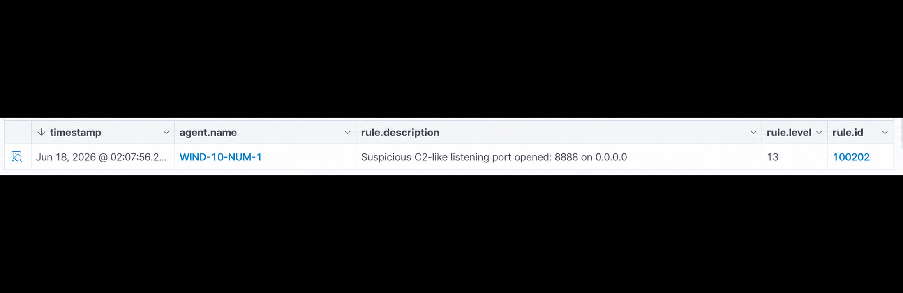

# Detection: Suspicious Listening Port Opened

## Objective

Detect when a Windows endpoint opens a listening port commonly associated with command and control activity or attacker tooling.

## MITRE ATT&CK

- Technique: T1071 — Application Layer Protocol
- Tactic: Command and Control

## Log Source

- Wazuh Syscollector
- Port inventory events
- `type: dbsync_ports`

## Rule Logic

Rule `100202` triggers when Syscollector detects a newly opened listening port and the port number matches one of the suspicious ports:

- `4444`
- `1337`
- `8888`
- `9001`

```xml
<rule id="100202" level="13">
  <if_sid>100201</if_sid>
  <field name="port.local_port" type="pcre2">^(4444|1337|8888|9001)$</field>
  <description>
    Suspicious listening port opened: $(port.local_port) on $(port.local_ip) |
    Process: $(port.process) |
    PID: $(port.pid)
  </description>
  <mitre>
    <id>T1071</id>
  </mitre>
  <group>network_ports,c2,suspicious_ports,</group>
</rule>
```
