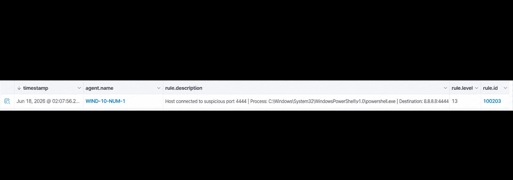

# Detection: Outbound Connection to Suspicious Port

## Objective

Detect when a Windows endpoint attempts to connect outbound to ports commonly associated with command and control activity.

## MITRE ATT&CK

- Technique: T1071 — Application Layer Protocol
- Tactic: Command and Control

## Log Source

- Sysmon Event ID 3 — Network Connection
- Wazuh Windows agent collecting Sysmon logs

## Rule Logic

Rule `100203` triggers when Sysmon logs a network connection where the destination port is one of the suspicious ports:

- `4444`
- `1337`
- `8888`
- `9001`

```xml
<rule id="100203" level="13">
  <if_sid>61613</if_sid>
  <field name="win.eventdata.destinationPort" type="pcre2">^(4444|1337|8888|9001)$</field>
  <description>
    Host connected to suspicious port $(win.eventdata.destinationPort) |
    Process: $(win.eventdata.image) |
    User: $(win.eventdata.user) |
    Source: $(win.eventdata.sourceIp):$(win.eventdata.sourcePort) |
    Destination: $(win.eventdata.destinationIp):$(win.eventdata.destinationPort)
  </description>
  <mitre>
    <id>T1071</id>
  </mitre>
  <group>network_anomaly,c2,suspicious_connection,</group>
</rule>
```
